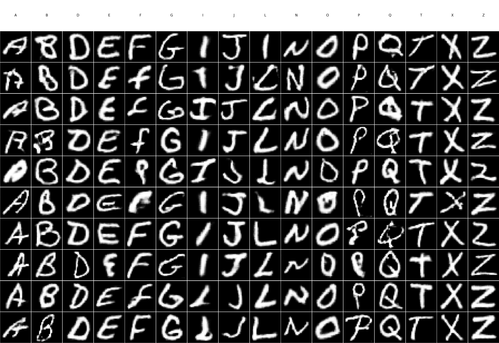

# ✨ EMNIST Letter Generation GAN


**A Conditional GAN for generating realistic handwritten letters using the EMNIST Letters dataset.**  

---

## 🧩 Features

- 🖼 **Conditional Generation**: Generate letters based on specific class labels.  
- 🔍 **Uppercase-Lowercase Filtering**: Custom classifier filters outputs for better accuracy.  
- 🏆 **Evaluation**: Qualitative visual inspection + optional metrics (FID, Inception Score).  
- 💾 **Checkpoints Included**: Pre-trained weights for generator & discriminator.  

---

## 📚 Dataset

[EMNIST Letters](https://www.nist.gov/itl/products-and-services/emnist-dataset)  
- 814,255 handwritten letters across 26 classes.  
- Extended MNIST dataset including both uppercase & lowercase letters.  

---

## 🏗 Model Architecture

**Conditional GAN** with:  

- **Generator**: Takes a random noise vector + class label → generates an image.  
- **Discriminator**: Determines if an image is real or generated, conditioned on class label.  

Adversarial training improves realism and diversity of generated letters over time.  

---

## ⚙️ Installation

```bash
# Clone the repository
git clone https://github.com/4ndrrw/EMNIST-Letter-Generation-GAN.git
cd EMNIST-Letter-Generation-GAN

# Create virtual environment
python -m venv venv
source venv/bin/activate  # Windows: venv\Scripts\activate

# Install dependencies
pip install -r requirements.txt
```

---

## 📈 Results

Example outputs from the trained GAN:



---

## 🛠 Tech Stack


---

## 🤝 Contributing

1. Fork the repository.  
2. Create a new branch (`git checkout -b feature-branch`).  
3. Commit your changes (`git commit -am 'Add new feature'`).  
4. Push to the branch (`git push origin feature-branch`).  
5. Open a Pull Request.  
